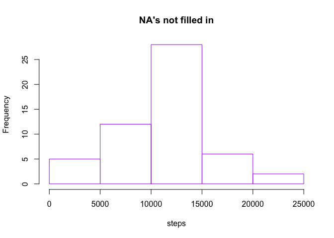

# Reproducible Research: Peer Assessment 1

## Loading and preprocessing the data

```r
setwd("/Users/boc/Dropbox/Coursera/ReproducibleResearch/RepData_PeerAssessment1")
```

## Load data from csv file

```r
data <- read.csv("data/activity.csv")
```

## What is mean total number of steps taken per day?

```r
# build a subset of the complete values
completes <- subset(data,complete.cases(data)==TRUE)    
```

## Calculate the total number of steps taken per day  

```r
# split the complete cases by date  
splitByDay <- split(completes,completes$date, drop=TRUE)
# build a numeric vector w/ daily sum of steps
dailySteps <- sapply(splitByDay, function(x) sum(x$steps)) 
```

## Make a histogram of the total number of steps taken each day 

```r
hist(dailySteps, main="Total Steps per Day", xlab="# Steps", col="light grey")

# lines for mean, median
abline(v=mean(dailySteps), lty=3, col="blue") 
abline(v=median(dailySteps), lty=4, col="red") 

# labels for mean, mediam
text(mean(dailySteps),25,labels="mean", pos=4, col="blue") 
text(mean(dailySteps),23,labels="median", pos=4, col="red")  

# rug to show observations
rug(dailySteps, col="dark grey")                               
```

 

## What is the average daily activity pattern?

```r
# split the complete cases by date  
splitByInterval <- split(completes,completes$interval, drop=TRUE)  
# calculate mean for intervals
intervalAvg <- sapply(splitByInterval, function(x) mean(x$steps)) 
# plot the time series
plot(intervalAvg, type="l",  
     main="Time Series - 5 Minute Time Series", 
     ylab="Average # Steps", 
     xlab="Interval INDEX", col="grey") 
# draw a red line thru the median  
abline(v=which.max(intervalAvg), lty=3, col="red")  
# label the max interval
text(which.max(intervalAvg),max(intervalAvg),  
     labels=paste("max = ",as.character(round(max(intervalAvg)))), 
     pos=4, col="blue")                                               
```

 

## Which 5-minute interval, on average across all the days in the dataset, contains the maximum number of steps? Answer: Interval 835 with a value of 104

```r
which.max(intervalAvg)
```

```
## 835 
## 104
```

## Imputing missing values

```r
#total number of NA's
sum(is.na(data[,1]))                                     
```

```
## [1] 2304
```

## Strategy for cleaning up NA's

```r
#replace NA's with mean of the 5-minute interval
x<-data[,1]         # number of steps in 5-minute intevals
y<-matrix(x,288,61) # so as to get average of 5-minute intevals across all days  

five_average <- apply(y,1,mean,na.rm=TRUE)

five_average_rep<- rep(five_average,61)

#create copy of data
data1 <-data   

for (i in 1:length(data1[,1])){  
    if(is.na(data1[i,1])==TRUE){
        data1[i,1]= five_average_rep[i]  
    }}
```

##Make a histogram of the total number of steps taken each day and Calculate and report the mean and median total number of steps taken per day. 

```r
daily1 <- c()


for (i in 1:61){              #  the total number of days in October and November is 31+30=61
    start<-(i-1)*288+1        #  there are 288 five-minute steps in a day; 24*60/5=288
    last<-(i-1)*288+288
    temp<-data1[start:last,1]    # extracting all 5-minute steps for each day
    daily1<-c(daily1,sum(temp))   # concatenating the daily totals 
}
```


```r
#compare with NA's filled in vs. original without NA's 
hist(daily1, xlab="steps",ylab="Frequency",main="Data with NA's filled in",border='green')
```

 

```r
hist(dailySteps, xlab="steps",ylab="Frequency",main="NA's not filled in",border='purple')
```

 

```r
#mean of dataset with NA's filled in
mean(daily1)
```

```
## [1] 10766.19
```

```r
#median of dataset with NA's filled in
median(daily1)
```

```
## [1] 10766.19
```

```r
#mean of dataset without NA's
mean(dailySteps)
```

```
## [1] 10766.19
```

```r
#mean of dataset without NA's
median(dailySteps)
```

```
## [1] 10765
```

```r
#difference in mean
mean(daily1) - mean(dailySteps)
```

```
## [1] 0
```

```r
#difference in median
median(daily1) - median(dailySteps)
```

```
## [1] 1.188679
```
     
     
## Are there differences in activity patterns between weekdays and weekends?


```r
#convert to date
data1$date <- as.Date(data1$date)
#fill in the day of week
data1$day <- weekdays(data1$date)
#find weekdays
data1_weekdays <- data1[(!data1$day %in% c("Saturday","Sunday")),]  
#find weekends
data1_weekend <- data1[(data1$day %in% c("Saturday","Sunday")),]   #  weekend

#get total weekday steps
weekday_steps <- data1_weekdays[,1]
temp <- matrix(weekday_steps,nrow=288)
weekday_steps_average <- apply(temp,1,mean)

#get total weekendsteps
weekend_steps <- data1_weekend[,1]
temp <- matrix(weekend_steps,nrow=288)
weekend_steps_average<-apply(temp,1,mean)
```


```r
#plot weekdays and weekends

plot(data$interval[1:288],weekday_steps_average, type="l",xlab='Intervals',ylab="Number of steps",col='red',lwd=2, main="Weekday")
```

 

```r
plot(data$interval[1:288],weekend_steps_average, type="l", xlab='Intervals',ylab="number of steps",col='blue',lwd=2,main="Weekend")
```

 


